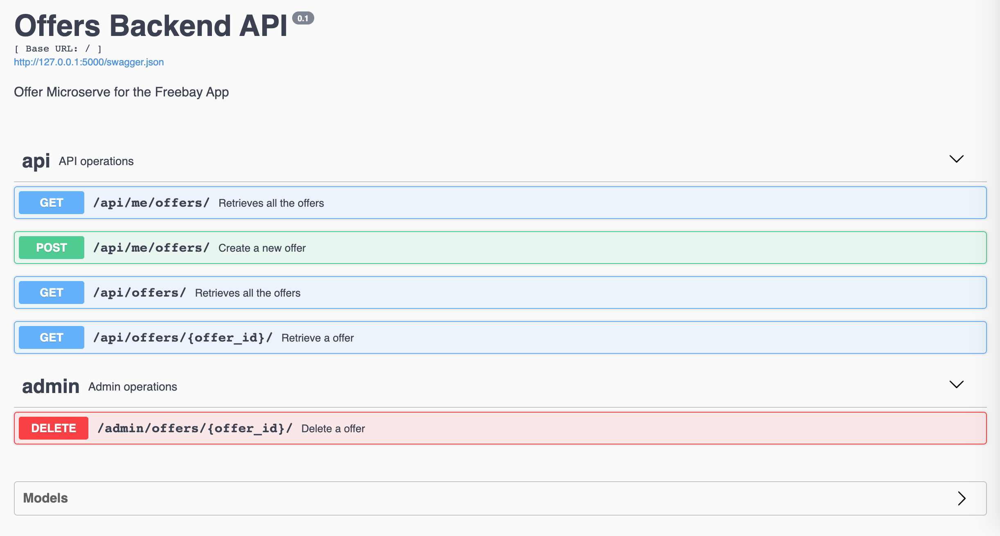

## Freebay App using Microservice Architecture

[](https://travis-ci.org/leizleho/freebay-microservices)
[](https://coveralls.io/github/leizleho/freebay-microservices?branch=master)



## Tech Stack
- Python
- Flask - lightweight micro web framework written in Python
- Flask-Restplus - Flask extension for building REST APIs with swagger documentation
- SQLite - database for development
- PostgreSQL - open source object-relational database system - will be used for production
- SQLAlchemy - open-source SQL toolkit and object-relational mapper for the Python


## Installation
```
# Clone repository
https://github.com/leizleho/freebay-microservices.git

# Create virtual environment
$ python -m venv env

# Activate the environment
$ source env/bin/activate

# Install dependencies
$ pip install -r requirements.txt

# Initialize database
$ python -i init_db.py

# Start the development server
$ FLASK_APP=wsgi.py flask run
```
